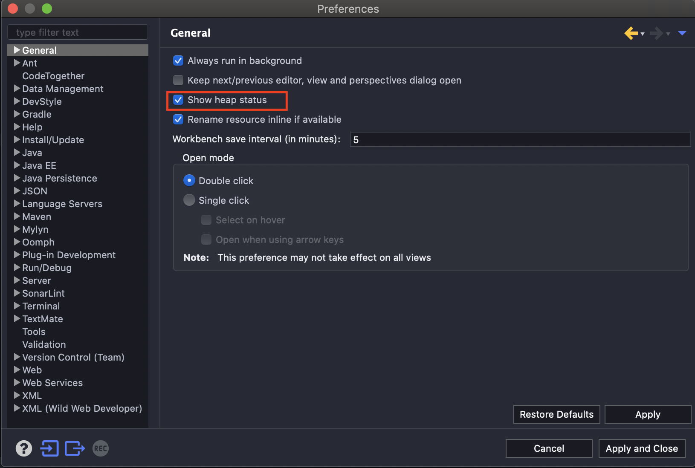
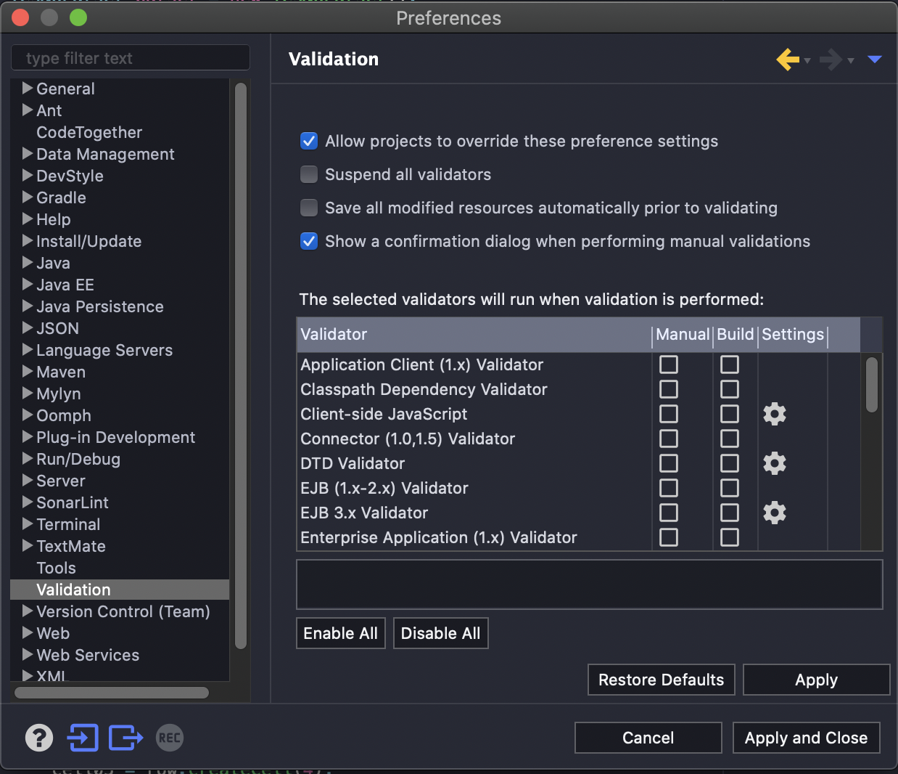
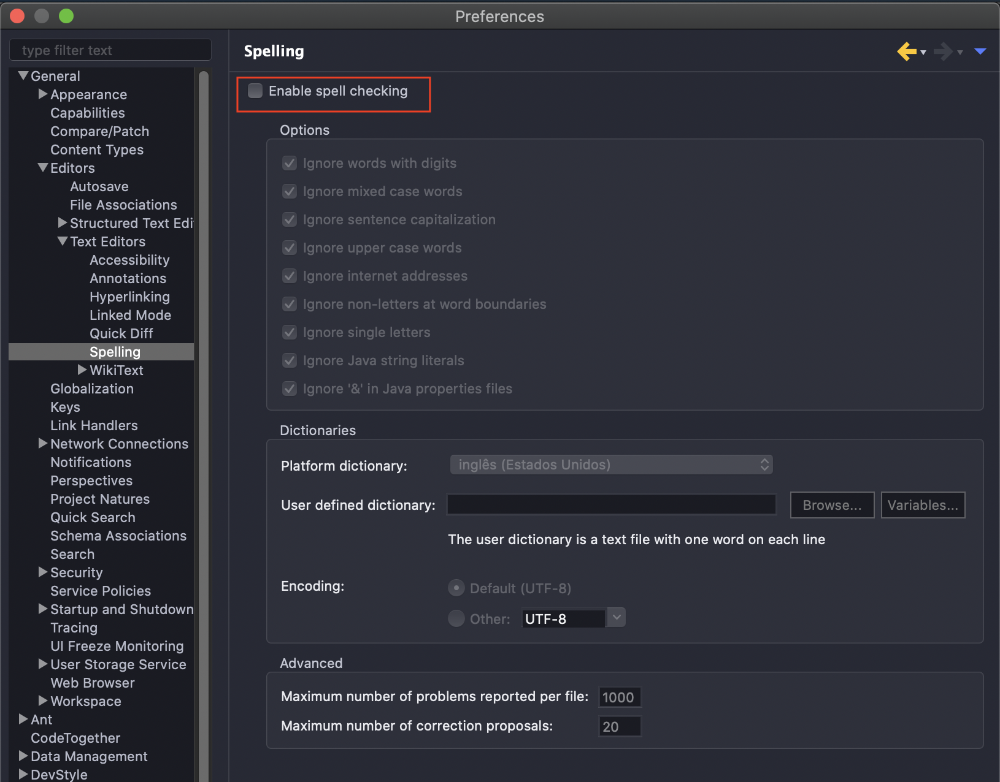
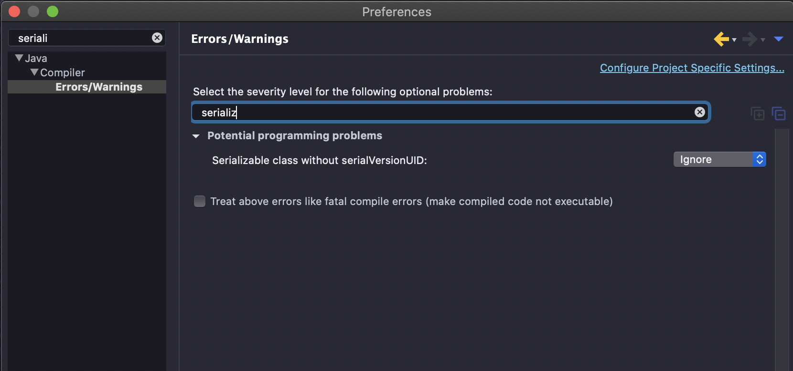
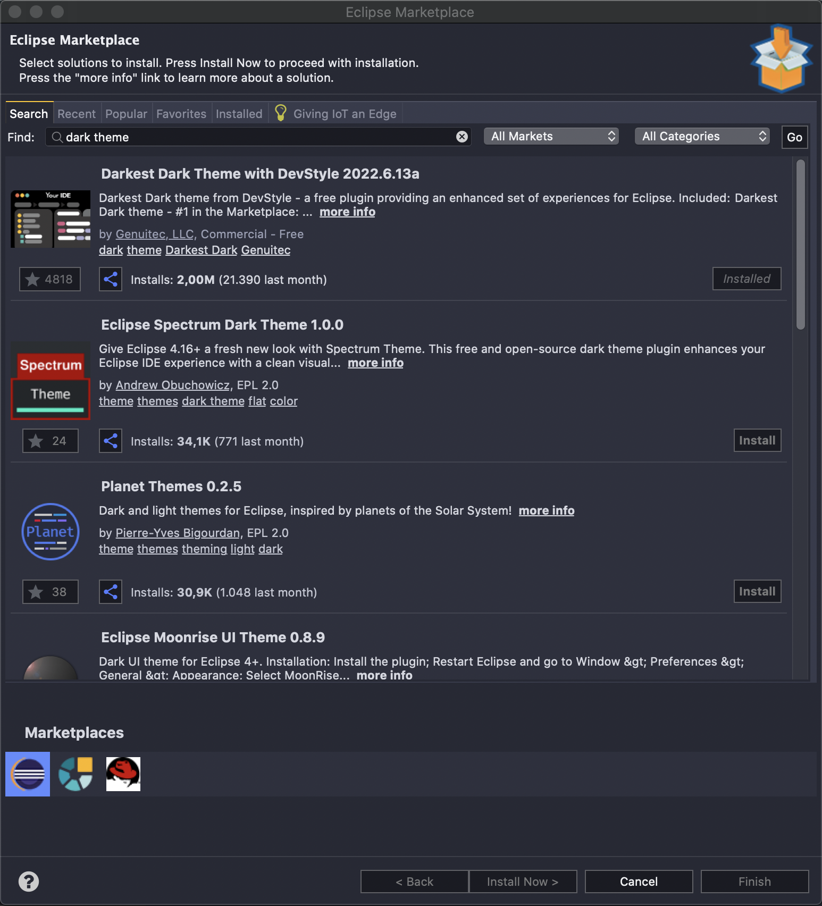

# Configurações e Otimizações Para o Eclipse IDE

Veremos como otimizar o eclipse para ficar mais leve, rápido e elegante 

## Configurando Show Heap Status
Em `preferences > general` habilite a opção `Show heap Status`, essa opção mostrará quando o eclipse está consumindo de mememória da máquina, e qual a memória máxima que foi dedicada a ele

## Configurando Encoding

Em `preferences > general > workspace - Text File encoding` e certifique-se que esteja selecionada a opção UTF-8. Realizamos esse procedimento para não haver problemas com caracteres acentuados 

## Configurando Xms e Xmx

Esses parâmetros server para delimitar os valores mínimos e máximos de memória RAM que serão dedicados ao eclipse. 

Para alterá-los precisamos editar o arquivo `eclipse.ini` esse arquivo estará na pasta do seu eclipse (onde instalou o executável). Darei o exemplo de minha máquina mas o diretório poderá ser diferente para cada um.

Procure pelo parâmetro `-Xms` e `-Xmx` altere-o de acordo com o hardware disponível. No meu caso vou deixar dedicado 2GB.

## Configurando Suspend All Validation

Em `preferences > validation` click no botão `disable all` e habilite somente o que julgar necessário, essas validações consomem recurso e muitas delas nem são utilizadas no projeto.

## Configurando Disable Spelling

Em `preferences > general > text editors > spelling` ou digite na barra de pesquisa `spelling` neste caso é mais simples. Desabilite a opção `Enable spell checking`. Essa configuração monitora se as palavras escritas na IDE estão corretas, semelhante ao um corretor ortográfico, consome recurso e não é lá muito útil. 

## Configurando Ignore SerialVersionUID

Em `preferences > compiler > errors/warnings` ou digite na barra de pesquisa por 'seriali' que já irá aparecer. Há diversas opções por isso novamente busque por 'serializ' que irá filtrar dentre as opções. Essa opção fica gerando uma warning quando criamos uma classe 

## Instalando o Dark Theme

Em `help > eclipse marketplace` busque por `dark theme` e instale o pluguin `darkest dark them with DevStyle` 

## Configurando um tema de código

Em `preferences > DevStyle > color themes` podemos customizar o tema da IDE, faça-o conforme desejar. Uma curiosidade legal é que podemos importar um tema como por exemplo o drakula ou tema do sublime text. 

Ao clicar no importe, você precisará de um arquivo xml com as especificações do tema desejado.

Baixe:
- [Drakula](./file/dracula-theme.xml)
- [Sublime Text](./file/sublime-text-monokai-extended.xml)

Prontinho, agora bora programaaaar!!