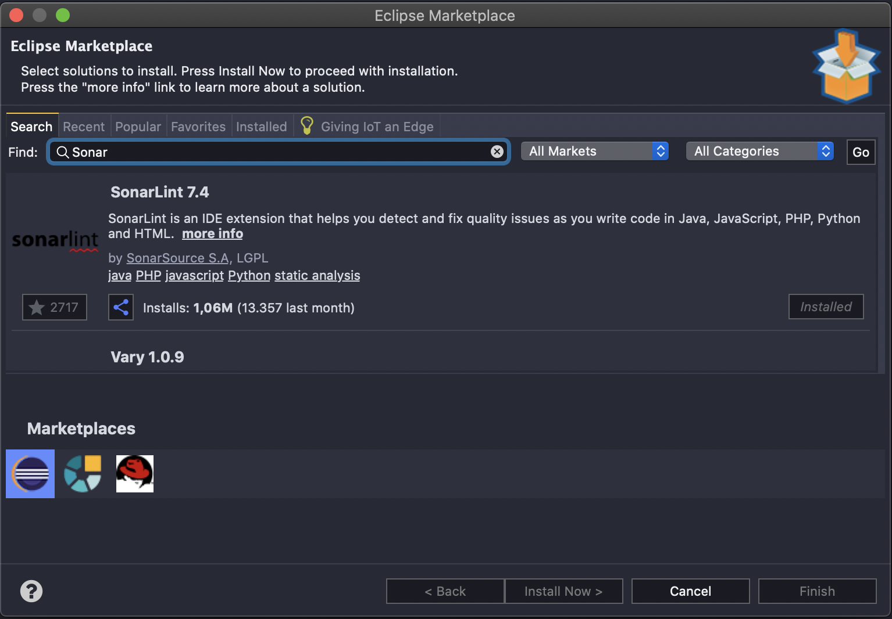
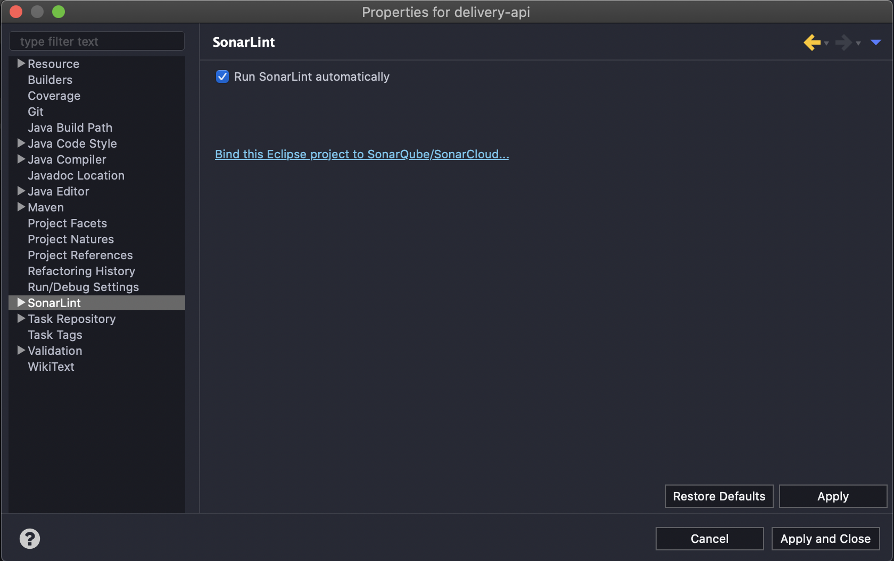
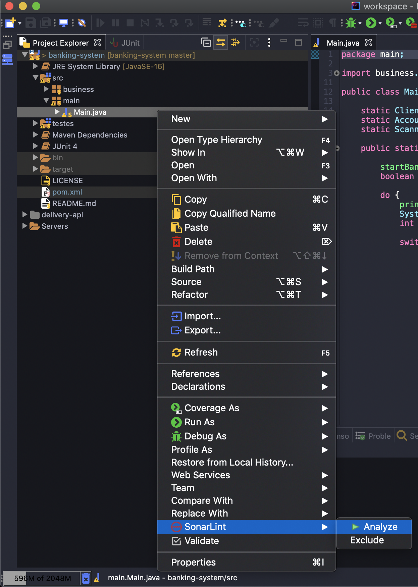
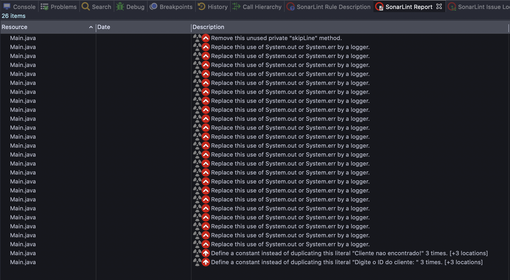
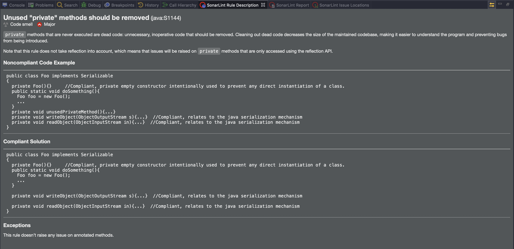

# Sonar Lint

SonarLint é uma extensão IDE Free and Open Source que identifica e ajuda a resolver problemas de qualidade e segurança à medida que codifica.

Em `help > eclipse marketplace` procure por `sonar lint`

Clique com direito sobre o projeto e selecione a opção `properties` em seguida `sonarlint` e desabilete a opção `run sonarlint automatically`

Por padrão o sonarlint vem com a analise automática habilitado, iremos desabilitá-la pois ficar escaneando os arquivos a cada alteração causa lentidão na IDE (dependendo do seu hardware)

Após desenvolver/alterar seus códigos, rode o sonarlint para analisar seus códigos e apontar possíveis melhorias

Clique com direito sobre o arquivos/projeto desejado, e selecione a opção `sonarlint > analize`

Após analizar o código o sonarlint apontará possíveis melhorias e problemas encontrados, além de um relatório sobre o código.

O sonarlint também nos dará uma direção com explicações sobre os erros e vulnerabilidades e sugestões de correção.

 

 Prontinho, agora bora programar!!